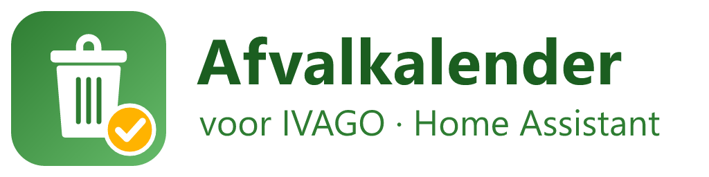

<p align="center"></p>

# IVAGO Afvalkalender – Home Assistant integratie

Custom integration die de **ophaalkalender van IVAGO** (Gent & Destelbergen) in Home Assistant brengt:
welk type huisvuil wordt vandaag/morgen/volgende keer opgehaald, en een kalender-entiteit met alle ophalingen.

Gebruikt dezelfde (onofficiële) endpoints als de kalender op
[ivago.be/nl/particulier/afval/ophaling](https://www.ivago.be/nl/particulier/afval/ophaling).
Geen account of API-key nodig, enkel je straat en huisnummer.

## Installatie

### Via HACS (custom repository)
1. HACS → Integraties → ⋮ → *Custom repositories*
2. `https://github.com/johan71gent/ha_ivago` toevoegen, categorie **Integration**
3. "IVAGO Afvalkalender" installeren en Home Assistant herstarten

### Manueel
Kopieer de map `custom_components/ivago` naar `<config>/custom_components/ivago` en herstart Home Assistant.

## Configuratie
*Instellingen → Apparaten & diensten → Integratie toevoegen → "IVAGO Afvalkalender"*

- **Straat**: begin van de straatnaam volstaat (bv. `Kortrijkse`). Bij meerdere treffers krijg je een keuzelijst
  (bv. `Kortrijksesteenweg (GENT)` vs `Kortrijksesteenweg (SINT-DENIJS-WESTREM)`).
- **Huisnummer**: bv. `12` of `12A`.

Het adres wordt gevalideerd bij IVAGO. Je kan meerdere adressen toevoegen (elk krijgt een eigen apparaat).

### Achteraf aanpassen
- **Adres wijzigen**: op de integratie → ⋮ → *Opnieuw configureren*. De entiteiten blijven bestaan (entity-id's veranderen niet, de naam van het apparaat wel).
- **Opties** (knop *Configureren*): updatefrequentie in uren (standaard 12), hoeveel dagen vooruit er wordt opgehaald (standaard 90). Wijzigingen worden meteen toegepast.

## Entiteiten
Per adres wordt één apparaat aangemaakt met:

| Entiteit | State | Attributen |
|---|---|---|
| `sensor.…_volgende_ophaling` | `Vandaag: PMD, Restafval` / `Morgen: GFT` / `Over 6 dagen: GFT, PMD, Restafval` / `Geen ophaling gepland` | `date`, `weekday`, `days_until`, `waste_types` (bv. `["PMD","RESTAFVAL"]`), `waste_types_names`, `waste_types_text` (bv. `PMD, Restafval`) |
| `sensor.…_volgende_ophaaldatum` | datum van de eerstvolgende ophaaldag (device_class `date`) | idem |
| `sensor.…_dagen_tot_volgende_ophaling` | aantal dagen (0 = vandaag) | |
| `sensor.…_ophaling_vandaag` | `PMD, Restafval` of `Geen` | `date`, `waste_types`, `has_pickup` |
| `sensor.…_ophaling_morgen` | idem voor morgen | idem |
| `sensor.…_restafval`, `…_pmd`, `…_gft`, `…_papier_en_karton`, `…_glas`, `…_grofvuil`, `…_kerstbomen` | volgende datum per afvalsoort | `days_until`, `is_today`, `is_tomorrow`, `upcoming` (volgende 5 data) |
| `calendar.…_ophaalkalender` | kalender met alle ophalingen (hele-dag events) | |

De data wordt standaard elke 12 uur opgehaald (90 dagen vooruit, beide instelbaar via *Configureren*) en de "vandaag/morgen"-sensoren worden net na middernacht herberekend.

## Voorbeelden

**Melding de avond voordien**
```yaml
automation:
  - alias: IVAGO herinnering
    trigger:
      - platform: time
        at: "19:00:00"
    condition:
      - condition: state
        entity_id: sensor.ivago_kortrijksesteenweg_gent_10_ophaling_morgen
        attribute: has_pickup
        state: true
    action:
      - service: notify.mobile_app_telefoon
        data:
          title: "Afval buitenzetten"
          message: "Morgen: {{ states('sensor.ivago_kortrijksesteenweg_gent_10_ophaling_morgen') }}"
```

**Dashboardkaart**
```yaml
type: entities
title: IVAGO
entities:
  - sensor.ivago_kortrijksesteenweg_gent_10_volgende_ophaling
  - sensor.ivago_kortrijksesteenweg_gent_10_dagen_tot_volgende_ophaling
  - sensor.ivago_kortrijksesteenweg_gent_10_restafval
  - sensor.ivago_kortrijksesteenweg_gent_10_pmd
  - sensor.ivago_kortrijksesteenweg_gent_10_gft
  - sensor.ivago_kortrijksesteenweg_gent_10_papier_en_karton
  - sensor.ivago_kortrijksesteenweg_gent_10_glas
```

## Hoe het werkt (API)
1. `POST https://www.ivago.be/nl/particulier/afval/ophaling` met `ivago_loc=<Straat (GEMEENTE)>`, `number=<nr>`,
   `form_id=garbage_address_form`, `op=Bekijk` → 303 + sessiecookie (adres zit in de server-side sessie; 200 = adres geweigerd).
2. `GET https://www.ivago.be/nl/particulier/garbage/pick-up/pickups?_format=json&type=&start=<unix>&end=<unix>` met die cookie →
   `[{"date":"2026-08-24","label":"PMD","classes":"PMD ivago-pmd","url":"/nl/particulier/afval/gids/pmd"}, …]`
3. Straten opzoeken: `GET https://www.ivago.be/nl/particulier/autocomplete/garbage/streets?q=Kortrijkse`.

Vervalt de sessie, dan wordt het adres automatisch opnieuw ingediend.

## Disclaimer
Niet-officiële integratie, niet verbonden met IVAGO. Als IVAGO zijn website wijzigt kan de integratie stoppen met werken.
